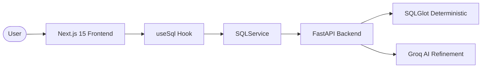

# SQLAgnostic | Universal SQL Workbench 🚀

[](https://sql-agnostic.akm07.dev)
[](#architecture)
[](LICENSE)

**SQLAgnostic** is a premium, open-source IDE designed for seamless SQL dialect transpilation. It combines the deterministic power of **SQLGlot** with an AI-driven **Refinement Layer** (Groq/Llama-3) to ensure logical parity across 20+ database architectures.

[**Visit the Live Workbench →**](https://sql-agnostic.akm07.dev)

---

## ✨ Features

- **Deterministic Transpilation**: Powered by [SQLGlot](https://github.com/tobymao/sqlglot) for precise dialect mapping.
- **AI Refinement Engine**: Multi-stage pipeline that uses Llama-3 to resolve semantic divergences and optimize queries.
- **Side-by-Side Diffing**: Visual comparison between deterministic and AI-refined SQL.
- **Enterprise Architecture**: Built with a modular Service-Hook-Component pattern using Next.js 15 and FastAPI.
- **Cross-Dialect Support**: Seamlessly switch between PostgreSQL, Snowflake, BigQuery, MySQL, Oracle, and more.

## 🏗️ Architecture

SQLAgnostic is designed with a **"BFF" (Backend-for-Frontend)** architecture:

- **Frontend**: Next.js 15 (App Router) organized into `services`, `hooks`, and `components`.
- **Backend**: Python FastAPI service running [SQLGlot](https://github.com/tobymao/sqlglot) and [Groq](https://groq.com) AI logic.
- **Security**: Asymmetric RS256 JWT verification, tiered rate limiting, and CSRF protection.



## 🛠️ Quick Start

### Local Development

1. **Clone the repository:**
   ```bash
   git clone https://github.com/akm07dev/sql-agnostic.git
   cd sql-agnostic
   ```

2. **Install dependencies:**
   ```bash
   npm install
   ```

3. **Configure Environment:**
   Create `.env.local` (Root) and `.env` (api/) with your Supabase and Groq keys.

4. **Run both servers:**
   ```bash
   npm run dev
   ```

## 📄 Documentation

- [**Developer Walkthrough**](WALKTHROUGH.md): Deep dive into the codebase and decision-making process.
- [**AI Context**](AGENTS.md): Detailed architectural guidelines for contributors and AI agents.

## 🤝 Contributing & License

Contributions are welcome! This project is licensed under the **MIT License**.

Built with ❤️ by [Ankit Megotia](https://github.com/akm07dev)
