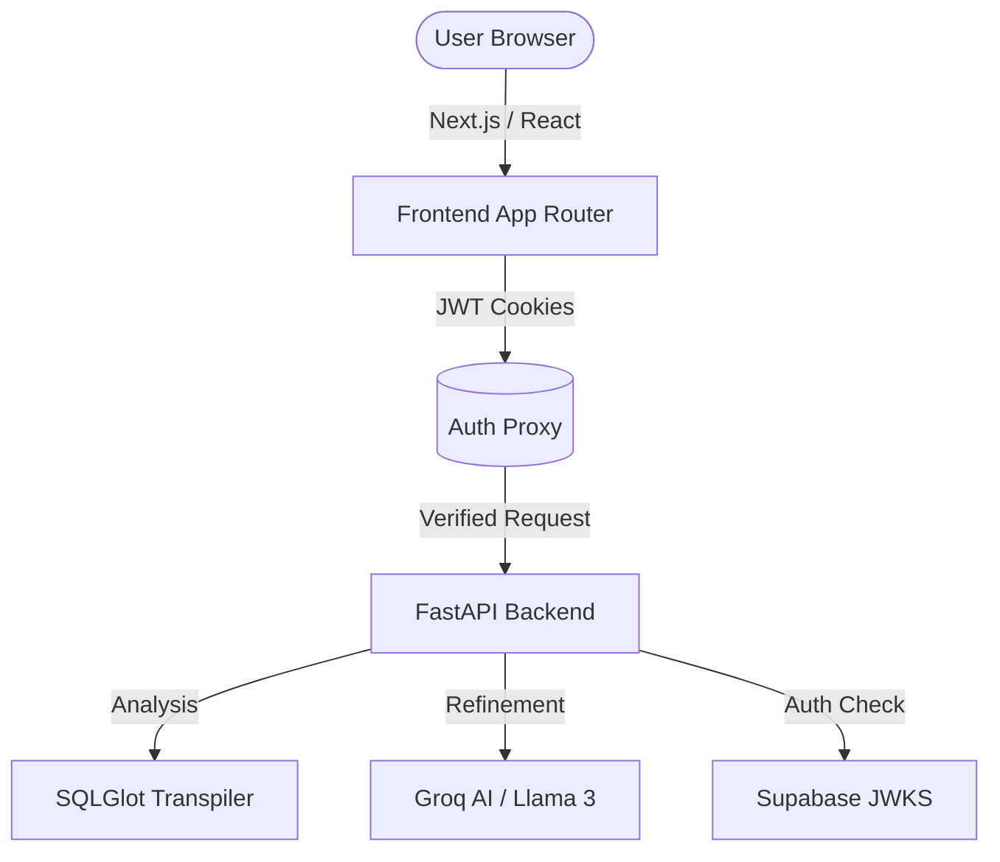

# SQLAgnostic 🚀

[](https://nextjs.org/)
[](https://fastapi.tiangolo.com/)
[](https://groq.com/)
[](https://opensource.org/licenses/MIT)

**SQLAgnostic** is a high-performance, AI-augmented SQL IDE designed to solve the complexity of database migration and multi-dialect development. It leverages deterministic transpilation mixed with LLM-powered refinement to provide "lossless" SQL conversion across 20+ database architectures.

 *(Placeholder for your logo)*

## ✨ Features

- **Multi-Dialect Transpilation**: Convert SQL between Oracle, PostgreSQL, Snowflake, BigQuery, T-SQL, and 15+ more using SQLGlot.
- **AI-Powered Refinement**: Uses Llama 3 (via Groq) to identify and fix semantic divergences that traditional transpilers miss (e.g., complex window functions, session-state variables).
- **Pro-Grade Diff Viewer**: Side-by-side comparison with syntax highlighting to track exactly what the AI changed.
- **Enterprise Security**: 
  - Transactional JWT verification via Supabase RS256 JWKS.
  - Multi-tiered rate limiting (Tiered for Anonymous vs. Authenticated).
  - CSRF protection on all mutating endpoints.
- **Premium UX**: Built with shadcn/ui, Tailwind CSS v4, and Monaco Editor.

## 🏗️ Architecture



## 🛠️ Tech Stack

- **Frontend**: Next.js 15 (App Router), TypeScript, Tailwind CSS v4, shadcn/ui.
- **Backend**: Python FastAPI.
- **Core Engine**: SQLGlot.
- **AI Intelligence**: Groq SDK (Llama 3.3 70B & 8B fallbacks).
- **Database/Auth**: Supabase.
- **Deployment**: Vercel (Next.js + Python Serverless Functions).

## 🚀 Getting Started

### Prerequisites

- Node.js 18+
- Python 3.9+
- Supabase Account
- Groq API Key

### Installation

1. **Clone the repository**
   ```bash
   git clone https://github.com/ankit-mego/sql-agnostic.git
   cd sql-agnostic
   ```

2. **Frontend Setup**
   ```bash
   npm install
   ```

3. **Backend Setup**
   ```bash
   python -m venv venv
   source venv/bin/activate  # venv\Scripts\activate on Windows
   pip install -r requirements.txt
   ```

4. **Environment Variables**
   Create a `.env.local` (Next.js) and `api/.env` (Python):
   ```env
   NEXT_PUBLIC_SUPABASE_URL=your_url
   NEXT_PUBLIC_SUPABASE_ANON_KEY=your_key
   GROQ_API_KEY=your_key
   ```

5. **Run Locally**
   ```bash
   npm run dev
   ```

## 🔒 Security

This project implements strict security patterns suitable for a production environment:
- **JWT Handling**: Passwords and sessions are managed entirely by Supabase. The FastAPI backend never sees user passwords; it only verifies asymmetric RSA-256 signatures from Supabase's JWKS.
- **Rate Limiting**: Integrated `slowapi` to prevent API abuse, with specialized limits for AI-heavy routes.
- **CSRF**: Custom header validation for all POST requests to block cross-site attacks.

## 📄 License

Distributed under the MIT License. See `LICENSE` for more information.

---
Built with ❤️ by [Ankit Megotia](https://github.com/ankit-mego)
