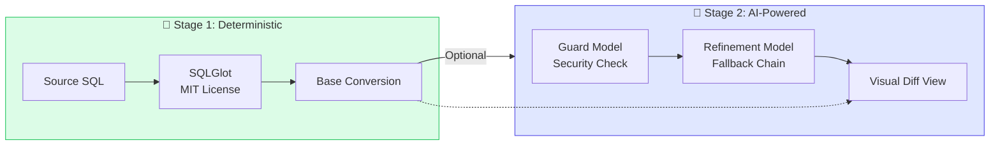
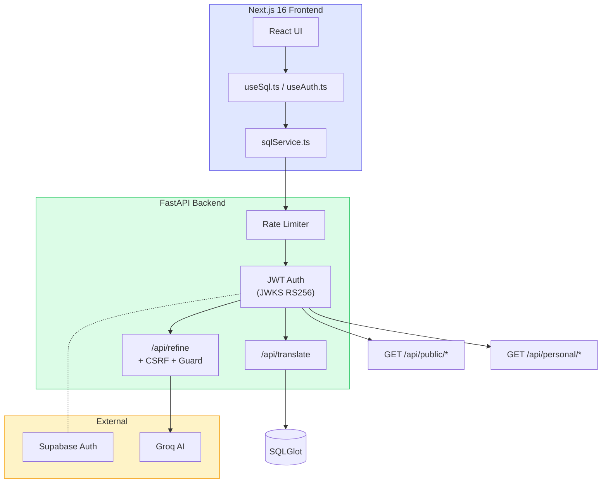

# SQLAgnostic

<p align="center">
  <strong>Convert SQL queries between 31+ database dialects</strong>
</p>

<p align="center">
  <a href="https://sql-agnostic.akm07.dev/">
    
  </a>
  <a href="https://github.com/akm07dev/sql-agnostic">
    
  </a>
</p>

<p align="center">
  
  
  
  
  
  
  
  
  
</p>

---

## 🚀 Live Demo

**Try it now**: [https://sql-agnostic.akm07.dev](https://sql-agnostic.akm07.dev)

A free, open-source SQL dialect converter with deterministic transpilation and optional AI-powered refinement.

## ✨ What Makes It Special

### Two-Stage Pipeline



**Stage 1 (SQLGlot)**: Fast, deterministic, never hallucinates  
**Stage 2 (AI)**: Semantic improvements only when you need them

### Key Features

| Feature | Description |
|---------|-------------|
| 🔀 **31 SQL Dialects** | PostgreSQL, MySQL, SQL Server, Oracle, Snowflake, BigQuery, DuckDB, ClickHouse, and 24 more |
| 🤖 **AI Refinement** | Optional Groq-powered improvements with guard model security |
| 🔄 **Model Fallback** | 5-model chain for 99%+ availability |
| 📝 **Monaco Editor** | VS Code-quality editing with syntax highlighting |
| 🆚 **Visual Diff** | Side-by-side comparison of transpiler vs AI output |
| 🔐 **Secure Auth** | JWT verification via JWKS, CSRF protection, tiered rate limiting |
| 💰 **Free Tier** | 5 conversions/min as guest, 20/min when signed in |
| 📊 **Activity Dashboard** | Global vs personal KPI comparison: usage, AI refinements, approval rating, positive ratings |
| 💾 **Session Persistence** | Editor state saved to sessionStorage — survive login redirects without losing work |

## 🛠️ Tech Stack

### Frontend
- **Next.js 16** (App Router, React 19, Server Components)
- **TypeScript** (strict mode, typed API contracts)
- **Tailwind CSS v4** (utility-first, dark mode)
- **shadcn/ui** (accessible UI components)
- **Monaco Editor** (VS Code editor, SQL syntax highlighting)

### Backend
- **FastAPI** (async Python, Pydantic validation)
- **SQLGlot** (MIT license, 31+ dialect support)
- **Groq** (AI refinement with model fallback)
- **Supabase** (JWT auth, PostgreSQL)
- **SlowAPI** (rate limiting)

### Infrastructure
- **Vercel** (frontend + Python serverless)
- **Resend** (transactional email)

## 🏗️ Architecture

### System Overview



### Frontend Pattern: Service-Hook-Component

```
┌─────────────────────────────────────┐
│  Component Layer (page.tsx)         │
│  - Rendering & user interaction     │
├─────────────────────────────────────┤
│  Hook Layer (useSql.ts)             │
│  - State management & lifecycle     │
├─────────────────────────────────────┤
│  Service Layer (sqlService.ts)      │
│  - API transport & error handling   │
└─────────────────────────────────────┘
```

**Documentation:**
- 📐 [Architecture Details](docs/ARCHITECTURE.md)
- 🔌 [API Reference](docs/API.md)
- 🚀 [Deployment Guide](docs/DEPLOYMENT.md)
- 🎓 [Engineering Walkthrough](docs/WALKTHROUGH.md)

## 📁 Project Structure

```
sql-agnostic/
├── api/
│   └── index.py                   # FastAPI: all endpoints, auth, rate limits, AI pipeline
├── docs/
│   ├── ARCHITECTURE.md
│   ├── API.md
│   └── DEPLOYMENT.md
├── supabase/
│   └── migrations/
│       ├── 0001_profiles_table.sql
│       ├── 0002_translations_table.sql  # Compound index (user_id, created_at DESC)
│       ├── 0003_feedback_table.sql
│       └── 0004_feedback_aggregates.sql # SECURITY DEFINER RPCs
├── src/
│   ├── proxy.ts                   # Next.js 16 middleware (session refresh)
│   ├── app/
│   │   ├── page.tsx               # Main SQL workbench
│   │   ├── layout.tsx             # Root layout + SEO metadata
│   │   ├── icon.tsx               # Dynamic favicon (edge ImageResponse)
│   │   ├── opengraph-image.tsx    # OG card (Zinc-950 dark, Blue-600)
│   │   ├── twitter-image.tsx      # Twitter card (same theme)
│   │   ├── manifest.ts            # PWA manifest
│   │   ├── sitemap.ts
│   │   ├── robots.ts
│   │   ├── globals.css
│   │   ├── dashboard/page.tsx     # Activity dashboard
│   │   ├── metrics/page.tsx       # Redirects → /dashboard
│   │   ├── login/
│   │   │   ├── page.tsx
│   │   │   ├── actions.ts         # Server actions: signUp, signIn, signOut, reset
│   │   │   ├── reset/
│   │   │   └── update-password/
│   │   └── auth/callback/         # OAuth callback handler
│   ├── components/
│   │   ├── layout/
│   │   │   ├── Navbar.tsx
│   │   │   └── Footer.tsx
│   │   ├── editor/
│   │   │   ├── AdaptiveEditor.tsx         # Monaco (desktop) / CodeMirror (mobile)
│   │   │   ├── DesktopMonacoEditor.tsx
│   │   │   ├── MobileCodeMirrorEditor.tsx
│   │   │   ├── EditorToolbar.tsx
│   │   │   └── AIMetadataPanel.tsx
│   │   ├── dashboard/
│   │   │   ├── FeedbackSection.tsx        # Global vs You KPI grid
│   │   │   ├── MetricCard.tsx
│   │   │   ├── FeedbackChart.tsx          # Recharts pie chart
│   │   │   ├── TransactionsList.tsx       # Paginated history + skeleton loader
│   │   │   ├── TransactionItem.tsx
│   │   │   └── QueryModal.tsx
│   │   ├── seo/JsonLd.tsx
│   │   └── theme-provider.tsx
│   ├── hooks/
│   │   ├── useAuth.ts             # Supabase auth state
│   │   ├── useSql.ts              # SQL workflow + sessionStorage persistence
│   │   └── useIsMobile.ts         # Responsive breakpoint
│   ├── services/
│   │   ├── sqlService.ts          # translate() + refine() API calls
│   │   └── dbService.ts           # saveTranslation(), updateTranslation(), saveFeedback()
│   ├── lib/
│   │   ├── constants.ts           # SQL_LIMITS, AUTH_MESSAGES, API_ENDPOINTS
│   │   ├── dialects.ts            # 31 dialect definitions
│   │   └── utils.ts               # cn() utility
│   ├── types/sql.ts
│   └── utils/supabase/            # Supabase client factories
├── public/
└── AGENTS.md                      # AI assistant context (this file)
```

## 🔒 Security Model

| Control | Implementation |
|---------|---------------|
| **JWT Verification** | JWKS endpoint (RS256), verify on every request |
| **Cookie Security** | HttpOnly, chunked cookie reassembly for SSR |
| **CSRF Protection** | `X-Requested-With` header on mutating endpoints |
| **AI Guard Model** | Prompt injection detection before processing |
| **Rate Limiting** | IP-based (guest) vs User ID (authenticated) |

```
Guest:     5  conversions/min on /api/translate
Auth:      20 conversions/min on /api/translate
           5  refinements/min on /api/refine (auth only)
```

The backend **never trusts** the frontend session. JWTs are independently verified via Supabase JWKS on every request.

## 🚀 Getting Started

### Prerequisites

- Node.js 18+
- Python 3.9+
- Supabase account (free tier works)
- Groq API key (free tier works)

### Quick Setup

```bash
# Clone & install
git clone https://github.com/akm07dev/sql-agnostic.git
cd sql-agnostic
npm install
pip install -r requirements.txt

# Environment setup
cp .env.example .env.local
# Edit .env.local with your keys:
# - NEXT_PUBLIC_SUPABASE_URL
# - NEXT_PUBLIC_SUPABASE_ANON_KEY
# - GROQ_API_KEY

# Run both Next.js and FastAPI
npm run dev
```

The app runs at `http://localhost:3000` with API at `http://localhost:53321`.

### Environment Variables

| Variable | Location | Purpose |
|----------|----------|---------|
| `NEXT_PUBLIC_SUPABASE_URL` | `.env.local` | Supabase project URL |
| `NEXT_PUBLIC_SUPABASE_ANON_KEY` | `.env.local` | Supabase public key |
| `GROQ_API_KEY` | `.env.local` | AI refinement service |
| `NEXT_PUBLIC_SITE_URL` | `.env.local` | Site URL for auth redirects (e.g., https://sql-agnostic.akm07.dev) |

---

<p align="center">
  Built by <a href="https://akm07.dev">akm07</a> • 
  <a href="https://github.com/akm07dev/sql-agnostic">GitHub</a> • 
  <a href="https://www.linkedin.com/in/ankitkm07/">LinkedIn</a>
</p>

## License

MIT
