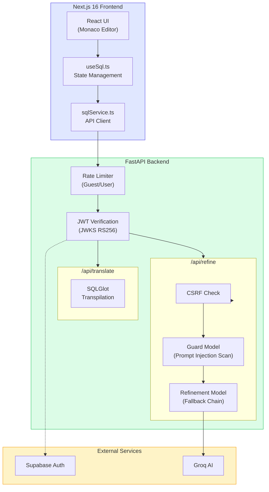
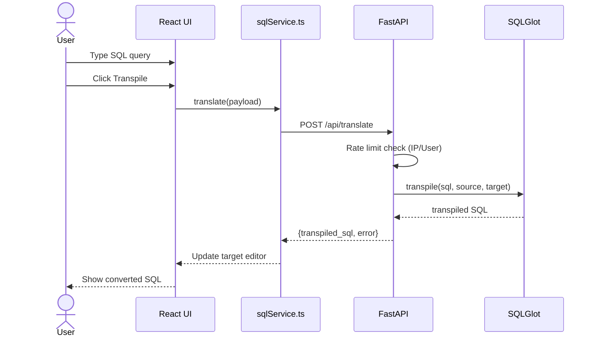
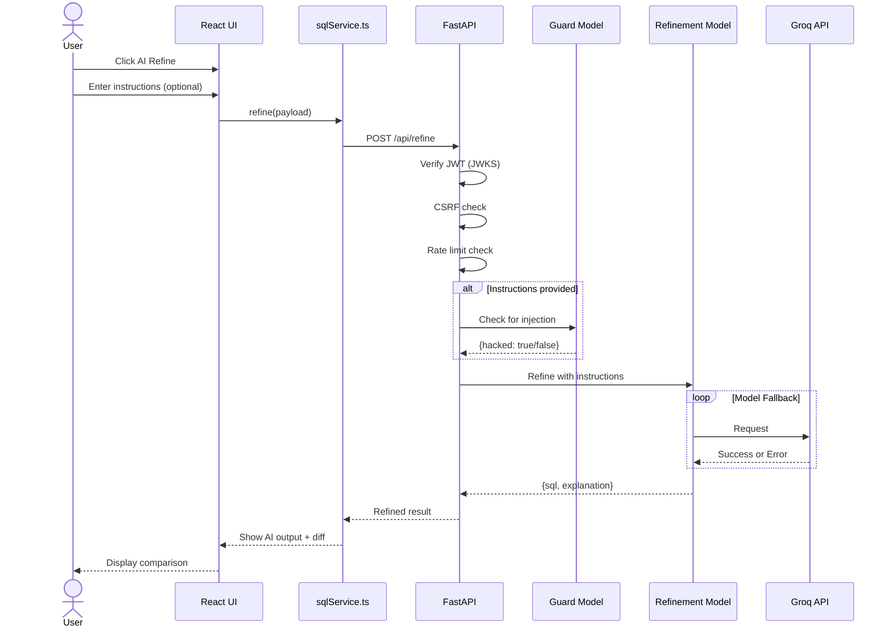
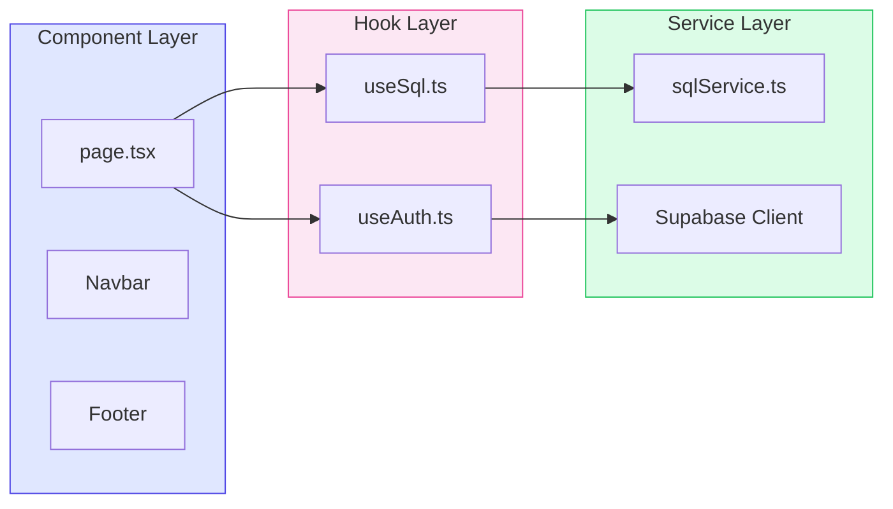
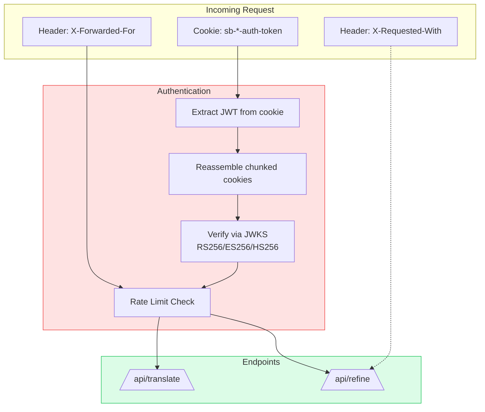
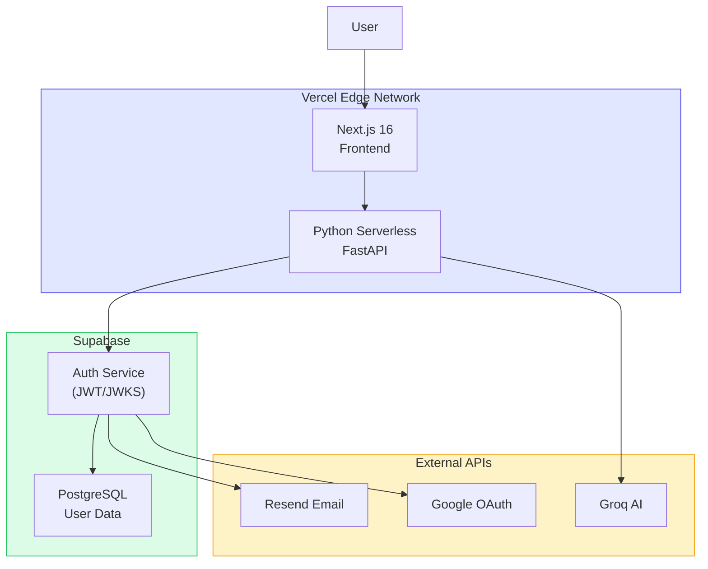

# Architecture

Visual system architecture and component interactions for SQLAgnostic.

## System Overview



## Data Flow

### SQL Translation Flow



### AI Refinement Flow



## Frontend Architecture

**Pattern**: Service-Hook-Component separation of concerns.



| Layer | Responsibility | Key Files |
|-------|---------------|-----------|
| **Service** | Network transport, error normalization | `src/services/sqlService.ts` |
| **Hooks** | State management, lifecycle logic | `src/hooks/useSql.ts`, `src/hooks/useAuth.ts` |
| **Components** | Rendering, user interaction | `src/app/page.tsx`, `src/components/layout/*` |

## Backend Architecture

**Entry Point**: `api/index.py` (single FastAPI file)

### Security Model



### Key Security Features

| Feature | Implementation | Purpose |
|---------|---------------|---------|
| **JWT Verification** | JWKS endpoint (RS256) | Trust boundary - never trust client session |
| **Cookie Chunking** | Reassembly of chunked SSR cookies | Next.js/Supabase compatibility |
| **Rate Limiting** | IP-based (guest) vs User ID (auth) | Cost control and abuse prevention |
| **CSRF Protection** | `X-Requested-With` header | Block cross-origin form attacks |

## Configuration Strategy

Centralized configuration reduces magic numbers and makes behavior explicit.

### Frontend (`src/lib/constants.ts`)

```typescript
export const SQL_LIMITS = {
  TRANSPILATION_MAX_CHARS: 100000,
  AI_REFINEMENT_MAX_CHARS: 10000,
};

export const SQL_DEFAULTS = {
  SOURCE_DIALECT: "postgres",
  TARGET_DIALECT: "mysql",
};
```

### Backend (`api/index.py`)

```python
CONFIG = {
    "LIMITS": {
        "TRANSLATE_AUTH_PER_MINUTE": "20/minute",
        "TRANSLATE_ANON_PER_MINUTE": "5/minute",
        "REFINE_PER_MINUTE": "5/minute",
    },
    "AI": {
        "GUARD_MODELS": ["llama-3.1-8b-instant", "gemma2-9b-it", ...],
        "REFINE_MODELS": ["llama-3.3-70b-versatile", "openai/gpt-oss-120b", ...],
    }
}
```

## Security Controls

| Control | Endpoint | Guest | Authenticated |
|---------|----------|-------|---------------|
| **JWT Required** | `/api/translate` | Optional | Optional |
| **JWT Required** | `/api/refine` | ❌ Blocked | ✅ Required |
| **CSRF Check** | `/api/translate` | ❌ | ❌ |
| **CSRF Check** | `/api/refine` | ❌ | ✅ Required |
| **Rate Limit** | `/api/translate` | 5/min (IP) | 20/min (User ID) |
| **Rate Limit** | `/api/refine` | ❌ | 5/min (User ID) |

### AI Pipeline Security

1. **Guard Model**: Scans user instructions for prompt injection before processing
2. **Input Validation**: 10K character limit for AI refinement context
3. **Output Sanitization**: SQLGlot re-formatting of AI output for structural consistency
4. **Error Handling**: Graceful degradation on AI service failures

## Deployment Topology



### Environment Variables

All environment variables are in `.env.local` at the project root.

| Variable | Purpose |
|----------|---------|
| `NEXT_PUBLIC_SUPABASE_URL` | Supabase project URL |
| `NEXT_PUBLIC_SUPABASE_ANON_KEY` | Supabase public anon key |
| `GROQ_API_KEY` | AI refinement service |

## Technology Choices

| Technology | Rationale |
|------------|-----------|
| **Next.js 16** | App Router, React 19, built-in OG image generation |
| **FastAPI** | Async Python, Pydantic validation, automatic OpenAPI |
| **SQLGlot** | MIT license, 31+ dialect support, deterministic transpilation |
| **Groq** | Fast inference, cheap rates, good model selection |
| **Supabase** | Open source, JWT auth, free tier generous |
| **Monaco Editor** | VS Code editor, SQL syntax highlighting, diff view |
| **Tailwind v4** | Utility-first, dark mode support, shadcn/ui compatible |
